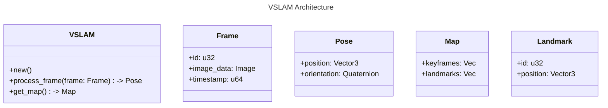

# vslam-rs
Hobby project for VSLAM built with Rust

## Architecture

```mermaid
---
title: VSLAM Architecture
---

classDiagram
    class VSLAM {
        +new()
        +process_frame(frame: Frame) -> Pose
        +get_map() -> Map
    }

    class Frame {
        +id: u32
        +image_data: Image
        +timestamp: u64
    }

    class Pose {
        +position: Vector3
        +orientation: Quaternion
    }

    class Map {
        +keyframes: Vec<Frame>
        +landmarks: Vec<Landmark>
    }

    class Landmark {
        +id: u32
        +position: Vector3
    }
```
